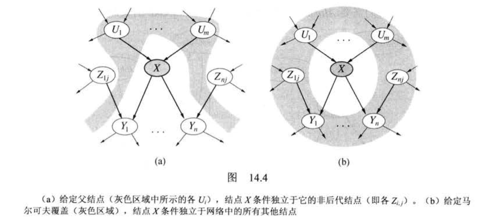
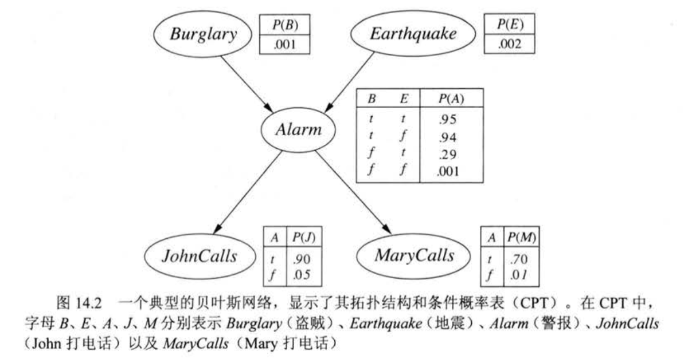
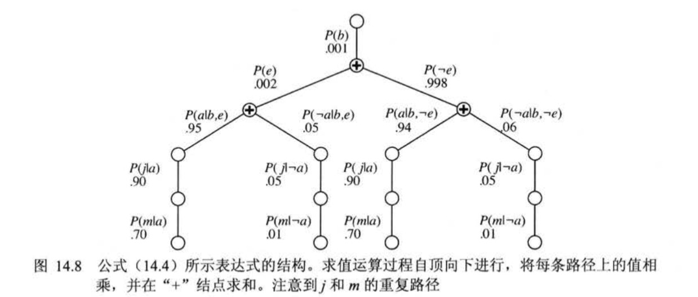

# 贝叶斯网络（Bayesian Network）

## 定义

- 是一个**有向无环图**（DAG）。
- 每个结点都标注了定量的概率信息。
  - 每个结点都对应了一个（离散的或连续的）随机变量。
  - 从结点 $X$ 指向 $Y$，则 $X$ 是 $Y$ 的父节点。
  - 每个结点 $X_i$ 有一个条件概率分布 $P(X_i | Parents(X_i))$ 量化**父节点对该结点的影响**。
- 每条边表示结点（变量）之间的依赖关系。
  - 如果两个节点之间存在有向边，则意味着一个节点的状态会影响另一个节点的状态。

1. 语法：结点，边，条件概率分布表（CPT）
2. 语义：条件独立性，
3. 推理：给定证据变量 $E$（某些已观察到的事件），计算查询变量 $X$，$Y$ 表示非证据非查询变量（隐变量）。

注：使用大写字母表示随机变量，小写字母表示随机变量的取值。

## 贝叶斯网络的语义

根据条件概率公式导出**链式规则（Chain Rule）**
$$ P(x_1, \cdots, x_n) = \prod \limits_{i=0}^n P(x_i | x_{i-1}, \cdots, x_1) $$

每个结点存储仅基于双亲结点的条件概率分布表
$$ P(X_i | X_{i-1}, \cdots, X_1) = P(X_i | Parents(X_i)) $$

## 条件独立

### 1. 同双亲结点

考虑如下图:

```shell
  C
 / \
A   B
```

其中 C 是 A、B 的双亲节点，由条件概率分布表得出联合概率分布为
$$P(a,b,c) = P(c)P(a|c)P(b|c)$$
即
$$\frac{P(a,b,c)}{P(c)} = P(a|c)P(b|c)$$
根据条件概率公式得
$$P(a,b|c) = P(a|c)P(b|c)$$
说明，当 C **给定状态**时，A、B 条件独立。

### 2. 顺序组合

考虑如下图:

```shell
A -> C -> B
```

其中 A 是 C、C 是 B 的双亲节点，由条件概率分布表得出联合概率分布为
$$P(a,b,c) = P(a)P(c|a)P(b|c)$$
即
$$\frac{P(a,b,c)}{P(c)} = P(b|c)\frac{P(a)P(c|a)}{P(c)}$$
根据条件概率公式和贝叶斯公式得
$$P(a,b|c) = P(a|c)P(b|c)$$
说明，当 C **给定状态**时，A、B 条件独立。

### 3. 同孩子结点

考虑如下图:

```shell
A   B
 \ /
  C
```

其中 A 是 C、C 是 B 的双亲节点，由条件概率分布表得出联合概率分布为
$$P(a,b,c) = P(a)P(b)P(c|a,b)$$
两边对 C 求和（积分）
$$\sum_{c}{P(a,b,c)} = \sum_{c}{P(a)P(b)P(c|a,b)}$$
得
$$P(a,b) = P(a)P(b)$$
说明，当 C **状态未知**时，A、B 条件独立。

### 性质



1. 当一个结点的**双亲结点**都给定，则其与**所有非后代结点**独立。
2. 当一个结点的**双亲结点**、**孩子结点**、**孩子结点的其他双亲结点**都给定（马尔可夫覆盖，Markov Blanket），则其与**所有结点**独立。

## 例子-警报器邻居模型

在该模型下，“我”在家里装了一个报警器。当我不在家时，有人非法入室（$Burglary$）或者地震（$Earthquake$）都有概率导致警报器（$Alarm$）响起，邻居 $John$ 和 $Mary$ 在警报器响起的时候有不同概率会打电话（$Call$）通知“我”。

其贝叶斯网络的图示如下：



## 推理

### 1. 通过枚举进行推理

已知**查询变量 $X$**，**证据变量 $e$**，**隐变量 $y$**,查询 $ P(X|e) $ 可以用公式
$$ P(X|e) = \alpha P(X|e) = \alpha \sum_{y}P(X,e,y) $$来回答。

如查询 $P(Burglary|JohnCalls = true, MaryCalls = true)$，
该查询的隐变量是 $Earthquake$ 和 $Alarm$ ，先简写为查询
$$P(B|j,m) = \alpha P(B,j,m) = \alpha\sum_e\sum_a P(B,j,m,e,a)$$
根据条件概率表改写公式计算该查询下 $Burglary = true$ 的概率。
$$P(b|j,m) = \alpha\sum_e\sum_a P(b)P(e)P(a|b,e)P(j|a)P(m|a) \\= \alpha P(b)\sum_e P(e)\sum_a P(a|b,e)P(j|a)P(m|a)$$

具体计算如下
$$
P(b|j,m) = \alpha P(b) \{P(e) [P(a|b,e)P(j|a)P(m|a)+P(\lnot a|b,e)P(j|\lnot a)P(m|\lnot a)]+\\
P(\lnot e) [P(a|b,\lnot e)P(j|a)P(m|a)+P(\lnot a|b,\lnot e)P(j|\lnot a)P(m|\lnot a)]\}\\
= \alpha 0.001*\{ 0.002*[0.95*0.90*0.70+0.05*0.05*0.01]+0.998*[0.94*0.90*0.70+0.06*0.05*0.01] \}\\
=\alpha 0.00059224
$$
同理，可得
$$P(\lnot b|j,m) = \alpha 0.0014919$$
则
$$P(B|j,m) = \alpha <0.00059224,0.0014919> \approx <0.284,0.716>$$
其中 $\alpha$ 用于*归一化*概率。计算结果表明在两个邻居给你打电话的情况下，出现盗贼的概率大约是 $28\%$。

计算过程可以用如下表达式树表示


显然，这种方法对 $P(j|a)P(m|a)$ 和 $P(j|\lnot a)P(m|\lnot a)$ 做了重复计算。

### 2. 变量消元算法

基于动态规划。

仍然以上面的情况为例子，将各项写成**因子**（Factor），得到

$$
P(B|j, m) = \alpha \underbrace{P(B)}_{\bm{f}_1(B)} \sum_e
\underbrace{P(e)}_{\bm{f}_2(E)}
\sum_a \underbrace{P(a|B,e)}_{\bm{f}_3(A,B,E)} \underbrace{P(j|a)}_{\bm{f}_4(A)}\underbrace{P(m|a)}_{\bm{f}_5(A)}
$$

每个因子只依赖于未确定的变量，是用参变量值为索引下标的矩阵，例如因为 $P(j|a)$、$P(m|a)$ 的因子 $\bm{f}_4(A)$、$\bm{f}_5(A)$ 只依赖于 $A$，因为查询已经确定了 $J$ 和 $M$，故它们是二元向量

$$
\bm{f}_4(A)=
\begin{bmatrix}
  P(j|a) \\
  P(j|\lnot a)
\end{bmatrix}=
\begin{bmatrix}
  0.90 \\
  0.05
\end{bmatrix}
\ \ \ \ \ \ \ \ \bm{f}_5(A)=
\begin{bmatrix}
  P(m|a) \\
  P(m|\lnot a)
\end{bmatrix}=
\begin{bmatrix}
  0.70 \\
  0.01
\end{bmatrix}
$$

则查询表达式可以写成

$$
P(b|j, m) = \alpha \bm{f}_1(B) \times \sum_e \bm{f}_2(E) \times\sum_a \bm{f}_3(A,B,E) \times \bm{f}_4(A) \times \bm{f}_5(A)
$$

其中的 $\times$ 不是普通的矩阵相乘，而是**逐点相乘**（Pointwise Product）。

计算步骤如下

- 首先，针对 $A$ 求和消元，得到新的 $2 \times 2$ 因子

$$
\bm{f}_6(B,E) = \sum_a \bm{f}_3(A,B,E) \times \bm{f}_4(A) \times \bm{f}_5(A)\\=[\bm{f}_3(a,B,E) \times \bm{f}_4(a) \times \bm{f}_5(a)]+[\bm{f}_3(\lnot a,B,E) \times \bm{f}_4(\lnot a) \times \bm{f}_5(\lnot a)]
$$

  剩下表达式

$$
P(b|j, m) = \alpha \bm{f}_1(B) \times \sum_e \bm{f}_2(E) \times \bm{f}_6(B,E)
$$

- 针对 $E$ 求和消元，得到

$$
\bm{f}_7(B) = \sum_e \bm{f}_2(E) \times \bm{f}_6(B,E)\\=\bm{f}_2(e) \times \bm{f}_6(B,e)+\bm{f}_2(\lnot e) \times \bm{f}_6(B,\lnot e)
$$

  剩下表达式

$$
P(b|j,m) = \alpha \bm{f}_1(B) \times \bm{f}_7(B)
$$

其中消去的顺序可以根据贪心决定，每次消去使下一个将被构造的因子规模最小化的变量。
